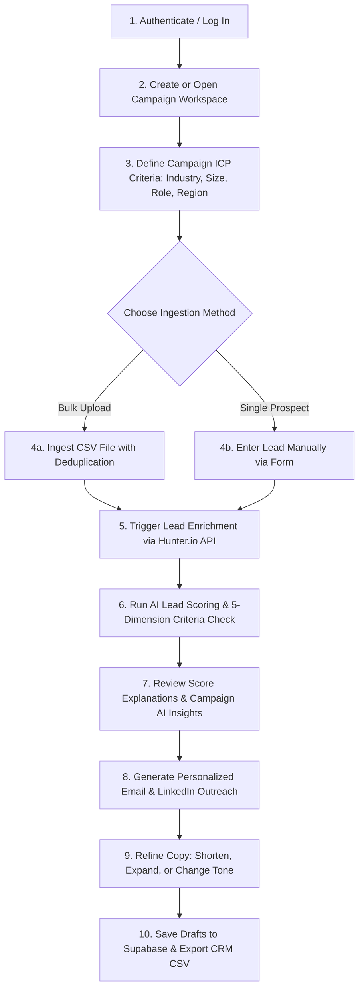
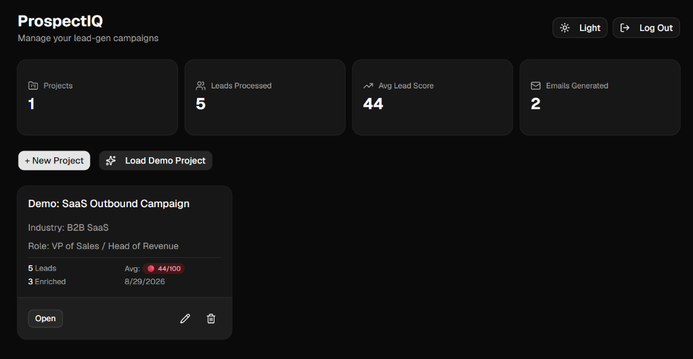
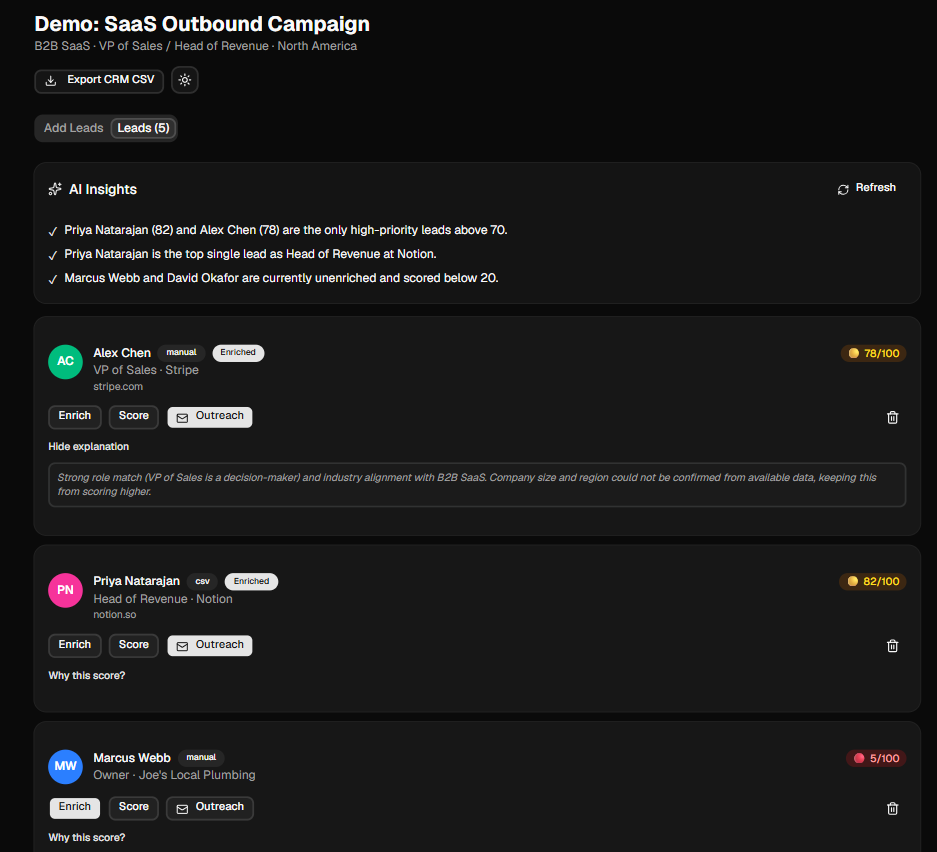
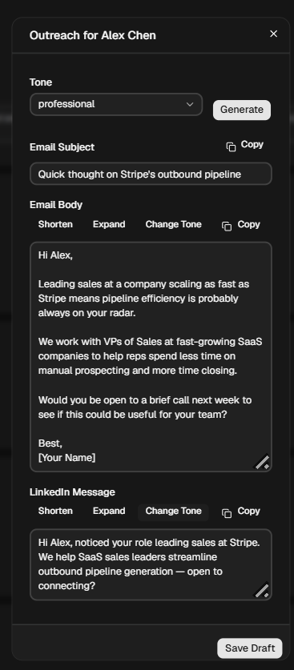
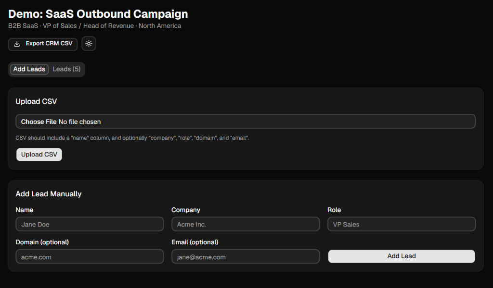
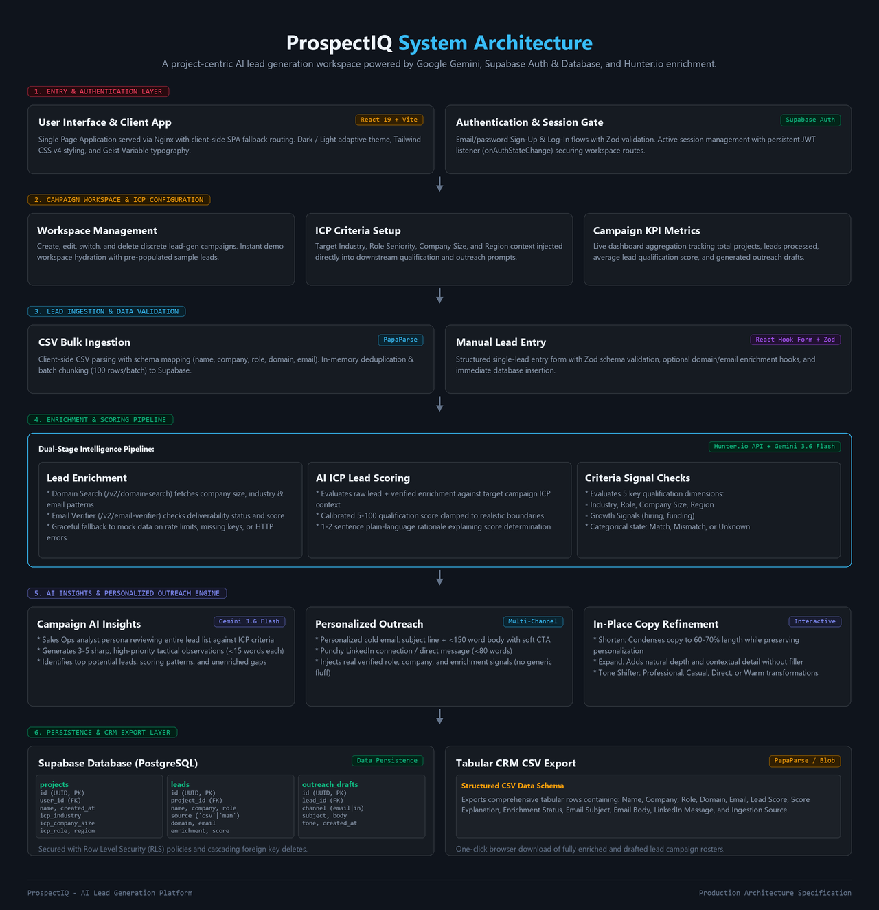

# ProspectIQ

An AI-assisted lead generation workspace for importing, enriching, scoring, analyzing, and engaging prospects.

---

## Overview

**ProspectIQ** is a campaign-centric lead generation and qualification workspace built for sales development representatives (SDRs), account executives, agency operators, and B2B founders. It bridges the gap between raw prospect data and actionable outbound sales execution.

While generic AI tools can generate one-off email templates in isolation, outbound sales prospecting requires end-to-end workflow coherence: establishing structured Ideal Customer Profile (ICP) criteria, importing leads from diverse sources, enriching company metadata and email deliverability signals, scoring prospects against target campaign requirements, identifying tactical pipeline insights, and crafting hyper-personalized multi-channel outreach.

ProspectIQ unifies these capabilities into a single, high-performance web workspace powered by **React 19**, **Google Gemini**, **Hunter.io**, and **Supabase**.

---

## Problem

B2B sales prospecting and outbound pipeline generation suffer from several persistent operational inefficiencies:

- **Fragmented Prospect Data**: Leads gathered from trade shows, web research, inbound forms, and CSV exports often sit in disorganized spreadsheets with missing fields and inconsistent formats.
- **Time-Consuming Manual Enrichment**: Manually researching company size, industry classification, website domains, and email patterns for every lead consumes hours of high-value selling time.
- **Inconsistent Qualification & Prioritization**: Without a standardized ICP evaluation framework, sales reps struggle to prioritize high-intent decision-makers, frequently expending effort on poor-fit accounts.
- **Generic, Impersonal Outreach**: Sending rigid copy-paste templates or ungrounded AI text leads to low engagement, high spam complaints, and damaged domain reputation.
- **Context Switching Across Disjointed Tools**: Juggling separate tools for data entry, enrichment, scoring, email drafting, note-taking, and CRM updates introduces unnecessary friction and lost context.

---

## Solution

ProspectIQ addresses these operational bottlenecks by providing an **integrated, AI-assisted prospecting pipeline**:

1. **Persistent Campaign & ICP Context**: Every project workspace maintains an Ideal Customer Profile specifying target industry, company size range, decision-maker role, and geographic region.
2. **Flexible Ingestion Pipeline**: Ingest prospect rosters via client-side bulk CSV parsing with automated header detection and deduplication, or insert leads manually with form validation.
3. **Automated Lead Enrichment**: Direct integration with Hunter.io verifies email deliverability and retrieves organization domain details, employee count, and industry classifications, with a built-in mock fallback for offline resilience.
4. **AI-Powered ICP Scoring & Qualification**: Leverages Google Gemini (`gemini-3.6-flash`) to evaluate each lead against the campaign's ICP, generating a calibrated 5–100 score, a plain-language justification, and a 5-dimension criteria breakdown.
5. **Campaign-Level Tactical Insights**: An automated AI sales analyst inspects the full lead list to highlight top-priority accounts, pattern trends, and unenriched gaps in under 15 words per insight.
6. **Multi-Channel Personalized Outreach**: Drafts personalized cold email copy (subject + body under 150 words) and LinkedIn connection notes (under 80 words) with interactive in-place copy controls (Shorten, Expand, Tone Shifter).
7. **Secure Cloud Persistence & CRM Export**: All projects, leads, scores, and outreach drafts persist in Supabase PostgreSQL under strict Row Level Security (RLS), ready for one-click CRM CSV export.

---

## Features

- **Supabase Authentication**: Secure user registration, password sign-in, and persistent session state listener (`onAuthStateChange`).
- **Campaign & Project Management**: Create, edit, switch, and delete discrete lead generation campaigns, each with isolated ICP definitions.
- **ICP Definition Engine**: Configure target Industry, Company Size, Decision-Maker Role, and Geographic Region per campaign.
- **Campaign Analytics & KPIs**: Live dashboard metrics computing total active projects, total leads processed, cumulative average lead score, and generated outbound drafts.
- **CSV Bulk Import**: Fast, client-side CSV parsing powered by `PapaParse` with header mapping, invalid row skipping, automatic email/name deduplication, and chunked batch insertion (100 rows/batch).
- **Manual Lead Entry**: Form validation via `React Hook Form` and `Zod` for rapid single-lead creation with optional domain and email inputs.
- **Automated Lead Enrichment**:
  - **Domain Search**: Queries Hunter.io `/v2/domain-search` to extract verified organization names, industry tags, company size, and domain email patterns.
  - **Email Verifier**: Queries Hunter.io `/v2/email-verifier` to validate deliverability status, confidence scores, and syntax validity.
  - **Resilient Fallback Engine**: Graceful fallback to structured mock enrichment data when API keys are absent, quotas are exceeded (HTTP 429), or endpoints return errors.
- **AI-Assisted Lead Scoring**:
  - Calibrated 5–100 numerical fit score evaluating the lead's role, company, industry, and enrichment signals against the project ICP.
  - Plain-language 1–2 sentence reasoning justifying the qualification score.
  - Expandable "Why this score?" drawer with visual criteria status pills.
- **5-Dimension Criteria Evaluation**:
  - `Industry Match`: Validates alignment with target industry vertical.
  - `Role Match`: Evaluates decision-maker authority and seniority.
  - `Company Size Match`: Confirms employee count against target ICP band.
  - `Region Match`: Verifies geographic alignment.
  - `Growth Signals`: Identifies hiring, funding, or expansion indicators from enrichment metadata.
  - Visual status badges: Match (`✓`), Mismatch (`✗`), or Unknown (`?`).
- **Dynamic Primary Action Guiding**: Intelligent workflow helper that dynamically highlights the next recommended step for each lead (`Enrich` $\rightarrow$ `Score` $\rightarrow$ `Outreach`).
- **AI Sales Insights Panel**: On-demand campaign analysis generating 3–5 concise, actionable observations (<15 words each) highlighting high-fit accounts (70+ score), top candidates, and unenriched leads.
- **Personalized Cold Outreach Generation**:
  - **Cold Email**: Tailored email subject line and concise body copy (<150 words) with soft, low-pressure calls to action.
  - **LinkedIn Message**: Short, punchy connection/outreach note (<80 words) optimized for LinkedIn messaging limits.
  - **Real Signal Grounding**: Incorporates verified role, company, and enrichment data, preventing generic placeholder templates.
- **In-Place Copy Refinement**:
  - **Shorten**: Condenses text to 60–70% length while preserving core personalization and CTA.
  - **Expand**: Adds natural contextual depth and detail without fluff.
  - **Tone Shifter**: Re-generates copy across **Professional**, **Casual**, **Direct**, and **Warm** voices.
- **Draft Management & Clipboard Utilities**: One-click copying for email subjects, email bodies, and LinkedIn messages, with persistent draft saving to Supabase.
- **Tabular CRM CSV Export**: Comprehensive export of campaign datasets including lead metadata, enrichment status, scores, explanations, and drafted email/LinkedIn copy.
- **Instant Demo Mode**: One-click sample project loader (`Demo: SaaS Outbound Campaign`) pre-populated with 5 realistic B2B SaaS leads across multiple qualification tiers, enrichment states, and pre-drafted outreach.
- **Dark Mode & Light Mode**: Seamless theme switching synchronized with DOM class lists and custom Tailwind OKLCH palettes.

---

## AI Capabilities

ProspectIQ integrates Google Gemini (`gemini-3.6-flash`) via structured JSON schema prompting and deterministic prompt engineering tailored for outbound sales workflows:

| Capability | Module / Function | Operational Objective | Model Output Shape |
| :--- | :--- | :--- | :--- |
| **ICP Lead Scoring** | `scoreLead` (`scoring.js`) | Evaluates lead attributes and enrichment signals against campaign ICP parameters (Industry, Size, Role, Region). | `{ score: number, explanation: string, criteria: { industryMatch, roleMatch, companySizeMatch, regionMatch, growthSignals } }` |
| **Campaign AI Insights** | `generateInsights` (`insights.js`) | Acts as a sales operations analyst reviewing the entire campaign roster to extract high-priority tactical observations (<15 words each). | `{ insights: string[] }` |
| **Outreach Generation** | `generateOutreach` (`outreach.js`) | Drafts grounded first-touch outreach across cold email (<150 words) and LinkedIn (<80 words) tailored to role and real signals in a chosen tone. | `{ emailSubject: string, emailBody: string, linkedinMessage: string }` |
| **Copy Refinement** | `rewriteOutreachText` (`outreach.js`) | Executes targeted rewrite transformations (`shorten`, `expand`, `tone`) on existing drafts while preserving key personalization details. | Plain text string |

> [!NOTE]
> **Directional AI Qualification vs. Predictive Conversion Guarantees**:
> Lead scoring and insights in ProspectIQ represent AI-assisted qualification against user-defined Ideal Customer Profile criteria. They serve as an editorial and prioritization signal for sales reps and do not constitute historical conversion probability models or live CRM telemetry.

---

## How It Works



1. **Create an Account**: Register or log in via Supabase authentication.
2. **Configure Campaign & ICP**: Create a project workspace and specify target criteria (Industry vertical, Company Size band, Target Role, and Target Region).
3. **Ingest Leads**: Upload a prospect CSV file or manually add leads via the validated entry form.
4. **Enrich Prospect Metadata**: Click **Enrich** on any lead to query Hunter.io for verified domain metadata, employee headcount, industry tags, and email deliverability.
5. **Score Leads**: Click **Score** to prompt Google Gemini (`gemini-3.6-flash`) against the campaign ICP, producing a 5–100 score, a concise explanation, and a 5-dimension criteria breakdown.
6. **Analyze Campaign Insights**: Open the **AI Insights** panel to receive instant tactical observations regarding top prospects, scoring trends, and unenriched gaps.
7. **Generate Outreach**: Click **Outreach** on qualified leads to generate personalized cold email subjects, email bodies, and LinkedIn connection notes.
8. **Refine & Polish Copy**: Use in-place controls to shorten, expand, or adjust copy tone across Professional, Casual, Direct, or Warm voices.
9. **Save & Export**: Save finalized drafts to Supabase PostgreSQL, copy text to the clipboard with one click, or export the entire campaign dataset to a CRM-ready CSV file.

---

## 📸 Screenshots

### Dashboard



Manage lead generation campaigns, track total leads processed, monitor average qualification scores, count drafted outreach emails, and load instant demo workspaces from a centralized dashboard.

---

### Lead Workspace



View campaign-level prospect rosters, generate campaign AI insights, inspect color-coded qualification score badges (0–100), expand detailed score explanations with 5-point criteria checklists, and trigger enrichment or outreach actions.

---

### AI Outreach Generation



Generate personalized cold emails and LinkedIn messages grounded in verified lead signals, select target tones, execute in-place text rewriting (Shorten, Expand, Change Tone), copy copy to the clipboard, and save drafts.

---

### Add Leads



Import prospect rosters in bulk via client-side CSV file parsing with automatic column detection and deduplication, or create individual lead records manually with form validation.

---

## 🏗️ Architecture



### Architectural Flow

1. **Client & Presentation Layer**: Built with **React 19**, **Vite 8**, and **Tailwind CSS v4**. Serves a responsive, accessible single-page application with adaptive dark/light theming, `@fontsource-variable/geist` typography, and shadcn/ui primitives.
2. **Authentication Gate**: Utilizes **Supabase Auth** for user registration, authentication, and session token lifecycle management via a persistent JWT listener (`onAuthStateChange`).
3. **Campaign Context & State Management**: Project-level Ideal Customer Profile parameters (Industry, Company Size, Role, Region) are stored and injected into downstream qualification, insights, and outreach generation pipelines.
4. **Data Ingestion Engine**:
   - `papaparse` handles client-side CSV parsing, header mapping, row deduplication, and chunked batch insertion (100 records/batch).
   - `react-hook-form` + `zod` enforce schema validation on manual lead entries.
5. **Dual-Stage Intelligence Pipeline**:
   - **Enrichment**: Queries the **Hunter.io API** (`/v2/domain-search` and `/v2/email-verifier`) using `axios` to retrieve company metadata and deliverability status, backed by an automatic mock fallback on quota limits.
   - **AI Qualification**: The client dispatches structured prompts directly to the **Google Gemini API** (`gemini-3.6-flash`) for lead scoring (5–100), plain-language justification, and 5-dimension criteria classification.
6. **AI Insights & Outreach Engine**: Google Gemini powers campaign-level sales ops observations and multi-channel personalized copy generation (Email + LinkedIn) with dynamic rewrite transformations (`shorten`, `expand`, `tone`).
7. **Data Persistence Layer**: All project records, lead profiles, enrichment payloads, scores, and outreach drafts are persisted in **Supabase PostgreSQL** protected by strict Row Level Security (RLS) policies and cascading foreign keys.
8. **CRM CSV Export Engine**: In-browser dataset aggregation compiles lead records, scores, enrichment states, and multi-channel outreach copy into structured CSV downloads via browser Blob APIs.

---

## 🛠️ Tech Stack

### Frontend & Core
- **React 19** (`react`, `react-dom`) — Component-based user interface architecture
- **Vite 8** (`vite`, `@vitejs/plugin-react`) — Next-generation frontend build tooling and development server
- **Tailwind CSS v4** (`tailwindcss`, `@tailwindcss/vite`) — Utility-first styling with OKLCH theme color tokens and `@theme` configuration
- **Geist Font** (`@fontsource-variable/geist`) — Modern variable typography
- **React Router v7** (`react-router-dom`) — Client-side declarative routing and protected route wrappers

### UI Components & Utilities
- **shadcn/ui** & **Base UI** (`@base-ui/react`, `shadcn`) — Accessible headless UI component primitives
- **Lucide React** (`lucide-react`) — Clean, consistent iconography
- **Sonner** (`sonner`) — Toast notification management
- **Class Utilities** (`clsx`, `tailwind-merge`, `class-variance-authority`) — Dynamic style composition

### Artificial Intelligence
- **Google Gemini API (`gemini-3.6-flash`)** — Structured JSON schema prompting for lead qualification scoring, sales operations insights, personalized outreach copywriting, and in-place text rewriting

### External APIs & Data Enrichment
- **Hunter.io API** — External domain search (`/v2/domain-search`) and email verification (`/v2/email-verifier`)
- **Axios** (`axios`) — HTTP client for external enrichment requests

### Data Processing & Forms
- **PapaParse** (`papaparse`) — Fast in-browser CSV parsing, header mapping, deduplication, and CRM export generation
- **React Hook Form** (`react-hook-form`) — Form state handling and submission workflows
- **Zod** (`zod`, `@hookform/resolvers`) — Type-safe schema validation for auth and lead entry forms

### Authentication & Backend Services
- **Supabase Auth** (`@supabase/supabase-js`) — User authentication and JWT session management
- **Supabase Database (PostgreSQL)** — Cloud persistence with Row Level Security (RLS) policies and cascading relational schema

### Containerization & Deployment
- **Docker** — Multi-stage container build (`node:20-alpine` builder $\rightarrow$ `nginx:alpine` runtime)
- **Nginx** — Production static web server with client-side SPA fallback routing configuration

---

## 📁 Project Structure

```
prospect-iq-ai-lead-gen/
├── Dockerfile                  # Multi-stage Docker container build definition
├── nginx.conf                  # Nginx static server & SPA fallback routing configuration
├── index.html                  # Application entry HTML template
├── package.json                # Project dependencies and script definitions
├── package-lock.json           # Locked dependency tree
├── vite.config.js              # Vite bundler, alias, and Tailwind CSS plugin configuration
├── eslint.config.js            # ESLint flat configuration for React & Hooks
├── components.json             # shadcn/ui configuration file
├── jsconfig.json               # Path alias mapping configuration (@/*)
├── docs/                       # Project documentation assets
│   ├── architecture.png        # Complete system architecture diagram
│   └── screenshots/            # High-resolution application screenshots
│       ├── dashboard.png
│       ├── lead-workspace.png
│       ├── outreach-generation.png
│       └── add-leads.png
├── supabase/                   # Supabase database definitions
│   └── schema.sql              # PostgreSQL DDL table schemas & RLS policies
├── public/                     # Static public assets
│   ├── favicon.svg             # ProspectIQ browser favicon
│   └── icons.svg               # Application SVG icons
└── src/                        # Application source code
    ├── main.jsx                # React root mount point & global providers
    ├── App.jsx                 # Application route definitions & auth gate
    ├── App.css                 # Application-level styling
    ├── index.css               # Tailwind imports, font definitions, and theme variables
    ├── pages/                  # Page-level route views
    │   ├── Login.jsx           # Sign-in and sign-up authentication page
    │   ├── Dashboard.jsx       # Campaign dashboard, KPI metrics, and project CRUD
    │   └── ProjectDetail.jsx   # Campaign workspace: CSV/manual ingestion, scoring, outreach & export
    ├── components/             # Reusable UI components
    │   ├── CriteriaChecklist.jsx # 5-dimension ICP criteria status badge checklist
    │   ├── InitialsAvatar.jsx  # Hash-based deterministic avatar component
    │   ├── InsightsPanel.jsx   # Campaign-level AI observations card
    │   ├── ProtectedRoute.jsx  # Authentication route guard wrapper
    │   ├── ScoreBadge.jsx      # Color-coded numerical lead qualification badge
    │   └── ui/                 # shadcn/ui primitive components
    │       ├── badge.jsx
    │       ├── button.jsx
    │       ├── card.jsx
    │       ├── dialog.jsx
    │       ├── input.jsx
    │       ├── label.jsx
    │       ├── select.jsx
    │       ├── tabs.jsx
    │       └── textarea.jsx
    ├── hooks/                  # Custom React hooks
    │   └── useDarkMode.js      # Theme persistence and DOM dark-class synchronization
    └── lib/                    # Core libraries, clients, and utilities
        ├── AuthContext.jsx     # Supabase auth session React context provider
        ├── avatarUtils.js      # Name initials parser and color hash resolver
        ├── demoData.js         # Pre-configured B2B SaaS demo project and sample leads
        ├── enrichment.js       # Hunter.io API integration and mock fallback handler
        ├── gemini.js           # Google Gemini API client and JSON response parser
        ├── insights.js         # Campaign-level sales ops insights prompt generator
        ├── outreach.js         # Cold email and LinkedIn message generation & rewriting
        ├── scoreUtils.js       # Qualification score tier classifier (Excellent, Good, Low)
        ├── scoring.js          # ICP lead qualification scoring prompt & criteria classifier
        ├── supabaseClient.js   # Supabase client initialization
        └── utils.js            # Tailwind CSS class merger utility (cn)
```

---

## 🚀 Getting Started

### Prerequisites
- **Node.js** 20.x or later
- **npm** 10.x or later
- A **Supabase** project instance (URL and anonymous API key)
- A **Google Gemini API** key
- A **Hunter.io API** key *(optional — the application includes an automatic mock fallback)*

### Local Setup

1. **Clone the repository**:
   ```bash
   git clone https://github.com/ZavedDavdani/prospect-iq-ai-lead-gen.git
   cd prospect-iq-ai-lead-gen
   ```

2. **Install dependencies**:
   ```bash
   npm install
   ```

3. **Configure environment variables**:
   Create a `.env` file in the root directory:
   ```env
   VITE_SUPABASE_URL=your_supabase_project_url
   VITE_SUPABASE_ANON_KEY=your_supabase_anon_key
   VITE_GEMINI_API_KEY=your_gemini_api_key
   VITE_HUNTER_API_KEY=your_hunter_api_key
   ```

4. **Initialize Supabase Database Schema**:
   In your Supabase project dashboard, open the **SQL Editor** and run the contents of [`supabase/schema.sql`](supabase/schema.sql) to create the `projects`, `leads`, and `outreach_drafts` tables with Row Level Security policies.

5. **Start the development server**:
   ```bash
   npm run dev
   ```
   Open `http://localhost:5173` in your browser.

6. **Build for production**:
   ```bash
   npm run build
   ```

7. **Lint the codebase**:
   ```bash
   npm run lint
   ```

---

## 🔐 Environment Variables

The application utilizes standard Vite frontend environment variables:

| Variable | Description | Requirement |
| :--- | :--- | :--- |
| `VITE_SUPABASE_URL` | The HTTPS endpoint URL for your Supabase project instance | Required |
| `VITE_SUPABASE_ANON_KEY` | The public anonymous API key for client-side Supabase requests | Required |
| `VITE_GEMINI_API_KEY` | Google Gemini API key for invoking the `gemini-3.6-flash` model | Required |
| `VITE_HUNTER_API_KEY` | Hunter.io API key for live domain search and email verification | Optional *(built-in fallback provided)* |

> [!IMPORTANT]
> Because ProspectIQ is a client-side Single Page Application, variables prefixed with `VITE_` are embedded into the static JavaScript bundle at build time. Never commit real API keys or sensitive production service credentials to version control.

---

## 🗄️ Supabase

ProspectIQ uses Supabase as its backend-as-a-service for user authentication, relational data persistence, and Row Level Security (RLS).

### Database Tables

- **`projects`**: Stores discrete campaign workspaces created by users.
  - Columns: `id` (UUID, PK), `user_id` (UUID, FK `auth.users`), `name` (TEXT), `icp_industry` (TEXT), `icp_company_size` (TEXT), `icp_role` (TEXT), `icp_region` (TEXT), `created_at` (TIMESTAMPTZ)
- **`leads`**: Stores prospect records belonging to a campaign.
  - Columns: `id` (UUID, PK), `project_id` (UUID, FK `projects.id` ON DELETE CASCADE), `name` (TEXT), `company` (TEXT), `role` (TEXT), `source` (`'csv' | 'manual'`), `domain` (TEXT), `email` (TEXT), `enrichment_data` (JSONB), `score` (INT), `score_explanation` (TEXT), `score_criteria` (JSONB), `created_at` (TIMESTAMPTZ)
- **`outreach_drafts`**: Stores generated cold email and LinkedIn outreach copy.
  - Columns: `id` (UUID, PK), `lead_id` (UUID, FK `leads.id` ON DELETE CASCADE), `channel` (`'email' | 'linkedin'`), `subject` (TEXT), `body` (TEXT), `tone` (TEXT), `created_at` (TIMESTAMPTZ)

### Security & Access Control
- **Row Level Security (RLS)** is enabled across all tables.
- Access to `projects` is restricted to the authenticated creator (`auth.uid() = user_id`).
- Access to child records (`leads`, `outreach_drafts`) is strictly validated via relational `EXISTS` subqueries verifying project ownership.
- Foreign key constraints enforce cascading deletions (`ON DELETE CASCADE`) to prevent orphaned lead and draft records.

---

## 🐳 Docker

ProspectIQ is containerized using a multi-stage Docker build and served via Nginx. A pre-built image is published on Docker Hub.

- **Docker Hub Image**: `zaved2507/prospectiq:latest`
- **Docker Hub Repository**: [https://hub.docker.com/r/zaved2507/prospectiq](https://hub.docker.com/r/zaved2507/prospectiq)

### Pull & Run from Docker Hub

```bash
docker pull zaved2507/prospectiq:latest
docker run -d -p 8080:80 zaved2507/prospectiq:latest
```

Visit `http://localhost:8080` in your browser.

### Build & Run Locally

To build the image locally with your build-time environment arguments:

```bash
docker build \
  --build-arg VITE_SUPABASE_URL=your_supabase_url \
  --build-arg VITE_SUPABASE_ANON_KEY=your_supabase_anon_key \
  --build-arg VITE_GEMINI_API_KEY=your_gemini_api_key \
  --build-arg VITE_HUNTER_API_KEY=your_hunter_api_key \
  -t prospectiq .

docker run -d -p 8080:80 prospectiq
```

### Container Architecture

- **Stage 1 (Builder)**: `node:20-alpine` installs dependencies, receives `ARG` parameters, and compiles the static Vite application bundle (`/app/dist`).
- **Stage 2 (Runtime Server)**: `nginx:alpine` copies the static output to `/usr/share/nginx/html` and serves traffic over port `80`.
- **SPA Fallback Routing**: `nginx.conf` routes non-asset requests to `/index.html` (`try_files $uri $uri/ /index.html;`) to support React Router client-side history navigation.

---

## 🔒 Security & Architecture Notes

- **Client-Side AI & API Integration**: In the current architecture, Google Gemini and Hunter.io requests are dispatched directly from the client browser. For portfolio demonstrations and internal tooling, this architecture minimizes backend operational complexity.
- **Client-Side Environment Variables**: Variables prefixed with `VITE_` are baked into the client JavaScript bundle at build time and are visible in browser network inspectors.
- **Database Row Level Security**: All database operations are authenticated via Supabase JWT tokens, and PostgreSQL RLS policies ensure that users can only read, insert, update, or delete data belonging to their own projects.
- **Production SaaS Recommendations**: For multi-tenant commercial SaaS deployments, external API requests should be proxied through a server-side gateway (e.g., FastAPI, Express, or Supabase Edge Functions) to protect API keys, enforce token budgets, and apply tenant rate-limiting.

---

## ⚠️ Current Limitations

- **Directional Qualification**: Lead scoring (5–100) and criteria evaluations are AI-assisted qualitative assessments based on ICP alignment, not historical CRM conversion analytics.
- **Enrichment Coverage**: Enrichment depth depends on available input data (company website domain or email address) and external Hunter.io index coverage.
- **No Direct Mail Sending**: The application generates, polishes, and saves email and LinkedIn copy, but does not send emails via SMTP/OAuth or trigger LinkedIn direct messages via official platform APIs.
- **No Direct CRM Two-Way Sync**: Prospect data is exported via tabular CSV rather than direct REST API synchronization with platforms such as Salesforce or HubSpot.

---

## 🔮 Future Improvements

- **Native CRM Integrations**: Direct two-way synchronization with HubSpot, Salesforce, and Pipedrive.
- **Automated Email Sending & Sequences**: Integration with SendGrid, Resend, or Google Workspace for automated multi-step cold email follow-up sequences.
- **Multi-Provider Lead Enrichment**: Ingestion from additional enrichment providers (Clearbit, Apollo, People Data Labs) for broader intent signals and executive phone numbers.
- **Automated Web Prospect Discovery**: AI web scraping and social directory discovery to suggest net-new prospect accounts matching campaign ICPs.
- **Backend AI Gateway**: Server-side proxy layer with centralized secret management, rate limiting, and credit-based usage quotas.
- **Team Collaboration & Workspaces**: Multi-seat organization accounts with role-based permissions, shared lead lists, and campaign assignment queues.

---

## 💡 Why ProspectIQ?

ProspectIQ demonstrates practical full-stack and frontend engineering patterns designed for real-world B2B utility:

- **Modern React 19 Architecture**: Modular component decomposition, type-safe form validation (`zod`), custom hooks (`useDarkMode`), and seamless routing with `react-router-dom` v7.
- **Resilient AI & API Pipelines**: Robust prompt engineering using structured JSON contracts, automatic response sanitization, and graceful fallback mechanisms for third-party enrichment failures.
- **High-Performance In-Browser Processing**: Fast client-side CSV parsing, header mapping, row deduplication, and multi-field tabular CRM export generation using `papaparse`.
- **Relational Data Modeling & Security**: Well-structured PostgreSQL schema with foreign key cascades and user-isolated Supabase Row Level Security policies.
- **Production-Ready Packaging**: Multi-stage Docker packaging with lightweight Nginx web serving and SPA routing fallback support.

---

## 👤 Author

**Zaved Davdani**

- **GitHub**: [@ZavedDavdani](https://github.com/ZavedDavdani)
- **Project Repository**: [https://github.com/ZavedDavdani/prospect-iq-ai-lead-gen](https://github.com/ZavedDavdani/prospect-iq-ai-lead-gen)
- **Docker Hub**: [@zaved2507](https://hub.docker.com/u/zaved2507)

